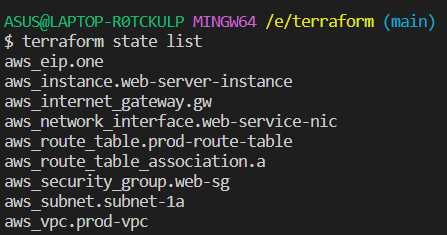

<br/>
<p align="center">
  <a href="https://github.com/ShaanCoding/ReadME-Generator">
    
  </a>

  <h3 align="center">Terraform Template</h3>

  <p align="center">
    Terraform starter template with AWS VPC, Subnet, Route table, Internet Gateway, Network Interface and Elastic IP
    <br/>
    <br/>
    <a href="https://github.com/jawad-nsu/terraform_vpc_subnet_igw/issues">Report Bug</a>
    .
    <a href="https://github.com/jawad-nsu/terraform_vpc_subnet_igw/issues">Request Feature</a>
  </p>
</p>

   

## Table Of Contents

- [About the Project](#about-the-project)
- [Built With](#built-with)
- [Getting Started](#getting-started)
  - [Prerequisites](#prerequisites)
  - [Installation](#installation)
- [Usage](#usage)
- [Roadmap](#roadmap)
- [Contributing](#contributing)
- [License](#license)
- [Authors](#authors)
- [Acknowledgements](#acknowledgements)

## About The Project

I wanted to create a terraform template to create several AWS resources through automation and using code as infrastructure.

Here's why:

- Automated infrastructure management :smile:
- Less error prone, less tedious espcially when you're deploying a large system that involves a complex topology
- Support for multi cloud provider like AWS, Azure, GCP, IBM

Here is a list of resources created
</br>


## Built With

HCL (HashiCorp Configuration Language) is a configuration language designed to be both human and machine-readable for use in infrastructure automation.

## Getting Started

Clone this repository to your local machine. Generate key pair from your AWS management console. Insert the key-pair name in (`variables.tf`). Generate access_key and secret_key from AWS console. I've attached an (`terraform.tfvars.example`) file, rename it to (`terraform.tfvars`) and insert your access_key, secret_key.

### Prerequisites

You need Terraform in your local machine

- Terraform

```sh
brew tap hashicorp/tap
brew install hashicorp/tap/terraform
```

### Installation

1. Clone the repo

```sh
git clone https://github.com/your_username_/Project-Name.git
```

2. Run Terraform

```sh
terraform apply --auto-approve
```

3. Show state

```sh
terraform state list
```

## Usage

Use this space to show useful examples of how a project can be used. Additional screenshots, code examples and demos work well in this space. You may also link to more resources.

_For more examples, please refer to the [Documentation](https://example.com)_

## Roadmap

See the [open issues](https://github.com/jawad-nsu/terraform_vpc_subnet_igw/issues) for a list of proposed features (and known issues).

## Contributing

Contributions are what make the open source community such an amazing place to be learn, inspire, and create. Any contributions you make are **greatly appreciated**.

- If you have suggestions for adding or removing projects, feel free to [open an issue](https://github.com/jawad-nsu/terraform_vpc_subnet_igw/issues/new) to discuss it, or directly create a pull request after you edit the files with necessary changes.
- Create individual PR for each suggestion.
- Please also read through the [Code Of Conduct](https://github.com/jawad-nsu/terraform_vpc_subnet_igw/CODE_OF_CONDUCT.md) before posting your first idea as well.

### Creating A Pull Request

1. Fork the Project
2. Create your Feature Branch (`git checkout -b feature/AmazingFeature`)
3. Commit your Changes (`git commit -m 'Add some AmazingFeature'`)
4. Push to the Branch (`git push origin feature/AmazingFeature`)
5. Open a Pull Request

## License

Distributed under the MIT License. See [LICENSE](https://github.com/jawad-nsu/terraform_vpc_subnet_igw/LICENSE.md) for more information.

## Authors

- **Jawad Rahim** - _Software Engineer_ - [Jawad Rahim](https://github.com/jawad-nsu) - _Built Terraform Template_

## Acknowledgements

- [Sanjeev-Thiyagarajan](https://github.com/Sanjeev-Thiyagarajan/Terraform-Crash-Course)
